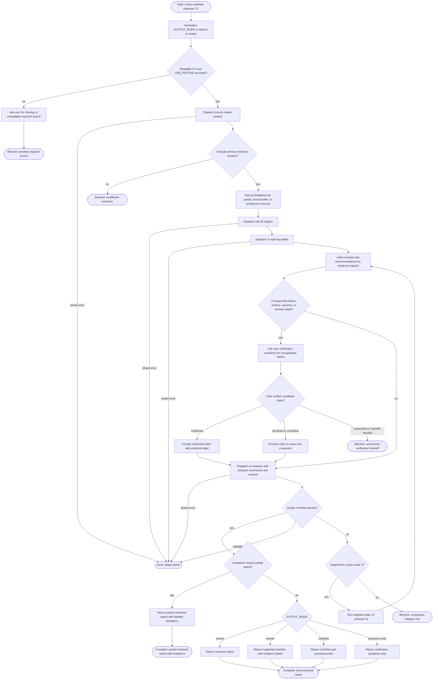

# Review Software Engineer CV

This workflow reviews a software engineer CV against a job posting. The agent may coordinate intake, role-fit mapping, truthful tailoring, validation, and a user-facing report, but it must not invent candidate facts, inflate seniority, fabricate metrics, or treat external resume guidance as candidate evidence. Primary evidence is the provided `CV`, `APPLICANT_CONTEXT`, and `JOB_POSTING`; optional fetched sources are background only.

