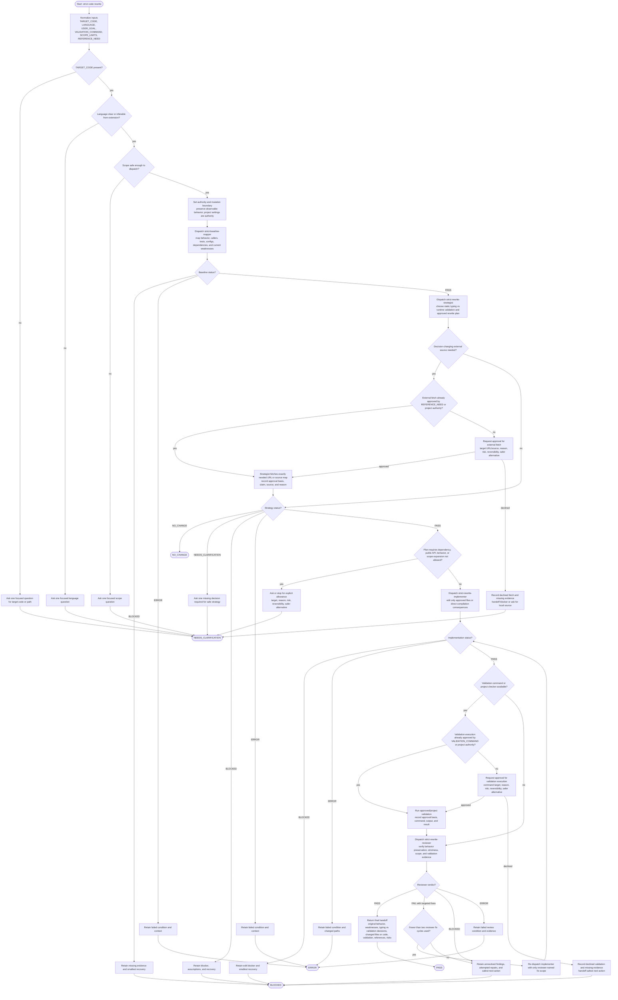

# Rewriting Code Strictly Workflow

This workflow is run by a strict-rewrite orchestrator for behavior-preserving rewrites of Python, TypeScript/JavaScript, or Go code. The orchestrator normalizes target, language, scope, goal, validation command, and reference need; dispatches one bundled subagent at a time; keeps compact evidence and decisions; and stops before dependency, public API, behavior, or scope changes unless explicitly allowed. Baseline and strategy phases are read-only, implementation edits only files justified by the approved strategy or direct compilation consequences, and review is read-only.

