# validate-implementation-plan

Audit an implementation plan without overwriting the source plan. The
orchestrator treats the raw plan as untrusted, limits mutation to the sanitized
snapshot and standalone audit report, and passes only sanitized snapshots,
structured requirements, findings, approved local technical evidence, and
summarized user answers across the trust boundary. `PLAN_PATH`, `OUTPUT_PATH`,
`SOURCE_CONTEXT_PATHS`, and user-provided clarification answers are treated as
explicit allow-list inputs when present. Missing or declined prerequisites route
to `AUDIT: BLOCKED`; external websites are not browsed for project-specific
facts.

```mermaid
flowchart TD
  START([Start]) --> INTAKE[Receive PLAN_PATH, ORIGIN_CONTEXT, optional OUTPUT_PATH and SOURCE_CONTEXT_PATHS]
  INTAKE --> PLAN_AUTH{PLAN_PATH provided as pre-authorized raw plan access?}
  PLAN_AUTH -->|no| AUDIT_BLOCKED([AUDIT: BLOCKED])
  PLAN_AUTH -->|yes| ORIGIN{ORIGIN_CONTEXT explicit?}

  ORIGIN -->|no| ASK_ORIGIN[Ask one concise clarification question]
  ASK_ORIGIN --> ANSWER_AUTH{User answer provided for downstream use?}
  ANSWER_AUTH -->|declined| AUDIT_BLOCKED
  ANSWER_AUTH -->|approved| RECORD_ORIGIN[Summarize and redact user answer]
  ORIGIN -->|yes| SET_PATHS[Derive SNAPSHOT_PATH and OUTPUT_PATH]
  RECORD_ORIGIN --> SET_PATHS

  SET_PATHS --> OUTPUT_AUTH{Snapshot and report targets authorized by derived or provided paths?}
  OUTPUT_AUTH -->|no| AUDIT_BLOCKED
  OUTPUT_AUTH -->|yes| LOAD_TRUST[Load trust and audit references just in time]
  LOAD_TRUST --> EXTERNAL_CHECK{External project-specific fetch requested?}
  EXTERNAL_CHECK -->|yes| AUDIT_BLOCKED
  EXTERNAL_CHECK -->|no| SNAPSHOT[Dispatch plan-snapshotter with raw PLAN_PATH only]

  SNAPSHOT --> SNAP_OK{Snapshot created?}
  SNAP_OK -->|no| RETRY_SNAPSHOT[Retry failed branch up to 3 cycles]
  RETRY_SNAPSHOT --> SNAP_RETRY_OK{Recovered?}
  SNAP_RETRY_OK -->|yes| SNAPSHOT
  SNAP_RETRY_OK -->|no| AUDIT_ERROR([AUDIT: ERROR])
  SNAP_OK -->|yes| EXTRACT[Dispatch requirements-extractor using SNAPSHOT_PATH and origin summary]

  EXTRACT --> REQ_OK{Numbered requirements extracted?}
  REQ_OK -->|no| RETRY_REQ[Retry failed branch up to 3 cycles]
  RETRY_REQ --> REQ_RETRY_OK{Recovered?}
  REQ_RETRY_OK -->|yes| EXTRACT
  REQ_RETRY_OK -->|no| AUDIT_BLOCKED
  REQ_OK -->|yes| TECH_EVIDENCE{SOURCE_CONTEXT_PATHS include approved local technical evidence beyond original request?}

  TECH_EVIDENCE -->|yes| TECH[Dispatch technical-researcher on approved local technical evidence only]
  TECH_EVIDENCE -->|no| SKIP_TECH[Skip technical-researcher]
  TECH --> TECH_OK{Research output valid?}
  TECH_OK -->|no| RETRY_TECH[Retry failed branch up to 3 cycles]
  RETRY_TECH --> TECH_RETRY_OK{Recovered?}
  TECH_RETRY_OK -->|yes| TECH
  TECH_RETRY_OK -->|no| CONTINUE_WITH_GAP[Record evidence gap]
  TECH_OK -->|yes| AUDITORS
  SKIP_TECH --> AUDITORS
  CONTINUE_WITH_GAP --> AUDITORS

  AUDITORS[Run independent auditors after requirement extraction] --> REQ_AUDIT[requirements-auditor checks traceability and missing coverage]
  AUDITORS --> YAGNI_AUDIT[yagni-auditor checks avoidable complexity and overbuild]
  AUDITORS --> ASM_AUDIT[assumptions-auditor checks risky assumptions and open questions]

  REQ_AUDIT --> VALIDATE_OUTPUTS[Validate subagent outputs]
  YAGNI_AUDIT --> VALIDATE_OUTPUTS
  ASM_AUDIT --> VALIDATE_OUTPUTS

  VALIDATE_OUTPUTS --> MALFORMED{Malformed output?}
  MALFORMED -->|yes| RETRY_BAD[Targeted retry of failed branch up to 3 cycles]
  RETRY_BAD --> RETRY_OK{Recovered?}
  RETRY_OK -->|yes| VALIDATE_OUTPUTS
  RETRY_OK -->|no| AUDIT_ERROR
  MALFORMED -->|no| ASSUMPTIONS{Unresolved assumptions could change findings?}

  ASSUMPTIONS -->|yes| ASK_ASSUMPTIONS[Ask assumptions-auditor proposed concise questions]
  ASK_ASSUMPTIONS --> ASM_ANSWER_AUTH{User answers approved for downstream use?}
  ASM_ANSWER_AUTH -->|declined| AUDIT_BLOCKED
  ASM_ANSWER_AUTH -->|approved| RECORD_ANSWERS[Summarize and redact answers as evidence]
  RECORD_ANSWERS --> RERUN_NEEDED[Retry affected audit branches only]
  RERUN_NEEDED --> VALIDATE_OUTPUTS

  ASSUMPTIONS -->|no| HARD_GATES{Hard gates unresolved?}
  HARD_GATES -->|yes| AUDIT_BLOCKED
  HARD_GATES -->|no| ANNOTATE[Dispatch plan-annotator to write standalone audit report]

  ANNOTATE --> REPORT_OK{Report written to OUTPUT_PATH?}
  REPORT_OK -->|no| RETRY_REPORT[Retry report-write branch up to 3 cycles]
  RETRY_REPORT --> REPORT_RETRY_OK{Recovered?}
  REPORT_RETRY_OK -->|yes| ANNOTATE
  REPORT_RETRY_OK -->|no| AUDIT_ERROR
  REPORT_OK -->|yes| STATUS{Findings require fail status?}
  STATUS -->|yes| AUDIT_FAIL([AUDIT: FAIL])
  STATUS -->|no| AUDIT_PASS([AUDIT: PASS])

  AUDIT_PASS --> HANDOFF[Reply with audit status, output path, sections covered, finding counts, open-question count, and reason]
  AUDIT_FAIL --> HANDOFF
  AUDIT_BLOCKED --> HANDOFF
  AUDIT_ERROR --> HANDOFF
```

