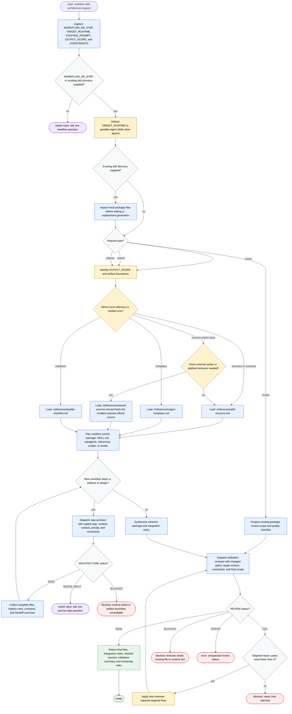

# Workflow Skill Architect Flow

Workflow Skill Architect is an orchestration workflow for turning repeatable
workflows into portable agent-skill packages. The orchestrator may clarify
inputs, inspect a supplied skill directory, choose artifact boundaries, load its
own bundled references just in time, dispatch `step-architect` and
`definition-reviewer`, and synthesize final files. Generated artifacts stay
standalone and portable; package mutation is limited to the requested skill
scope and validation repairs.

Readiness rule: return final skill files only after all needed
`step-architect` work returns `ARCHITECTURE: PASS`, synthesis is complete, and
`definition-reviewer` returns `REVIEW: PASS`. A `REVIEW: FAIL` may trigger at
most three targeted repair cycles before the workflow returns blocked with the
remaining findings.

Completion states: ready, needs input, blocked, or error.
